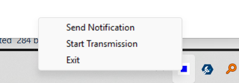

# Web SCADA Project

## Overview
This project consists of a frontend and a backend for a Web SCADA system. The backend includes a WebSocket server that can run as a standalone application or as a Windows service. The frontend is a simple web interface.

## Prerequisites
- Python 3.10 or higher
- pip (Python package manager)
- PyInstaller (for building executables)

## Setup
1. Clone the repository.
2. Navigate to the project directory.
3. Install dependencies:
   ```bash
   make install
   ```

## Running the Project
### Standalone Mode
To run the backend in standalone mode:
```bash
make run
```

### Build Executable
To build the backend as a standalone executable:
```bash
make build
```

### Clean Up
To clean up build artifacts:
```bash
make clean
```

## Frontend
Open `frontend/index.html` in a web browser to access the frontend interface.

## Features
See `FEATURES.md` for a detailed list of features.

## Milestones

### Test Page Screenshots

Below are screenshots demonstrating the functionality of the test page:

1. **Before State Update**: This screenshot shows the test page before any state is set or updated. It represents the initial state of the page.

   

2. **After State Update**: This screenshot illustrates the test page after clicking the "Update State" button. It shows the updated state values.

   

3. **Service Communication**: The screenshot highlights the communication between the frontend and backend services, showcasing the successful interaction.

   
